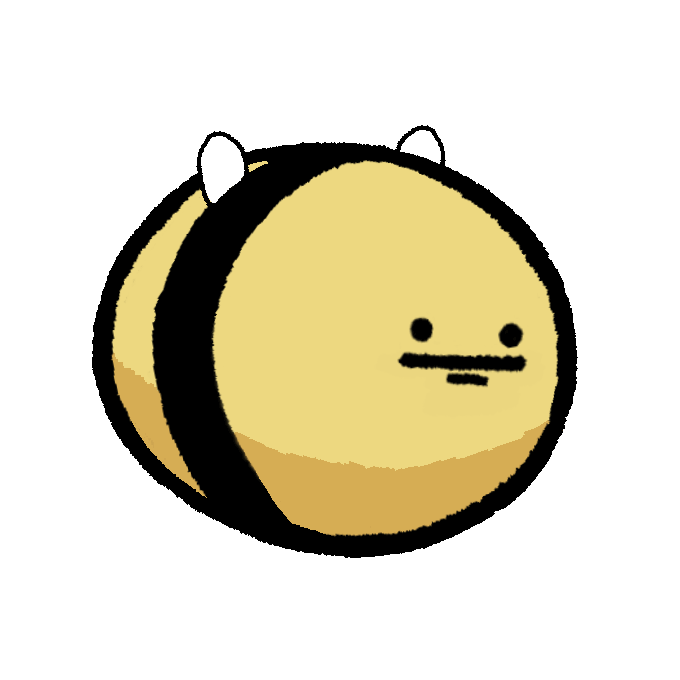

# "beee" is a repository for the scripts in the game "beee"
All scripts were contributed by murvyn. The list of scripts here is not comprehensive to the project but meant to serve as a portfolio.

# a preview of beee

  <iframe style="position: absolute; top: 0; left: 0; width: 100%; height: 100%;" src="https://www.youtube.com/embed/yourvideoid?autoplay=1&loop=1&playlist=yourvideoid" frameborder="0" allow="autoplay" allowfullscreen></iframe>

## Images of beee and friends

